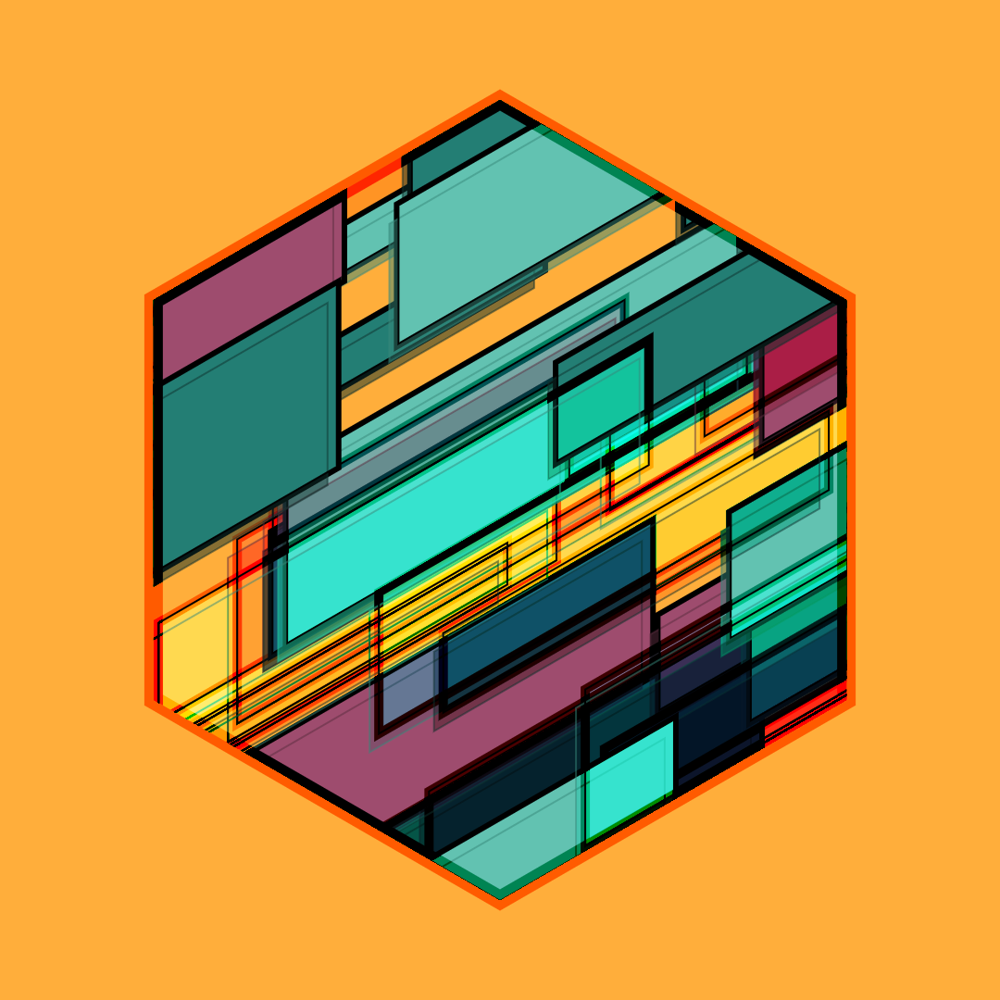
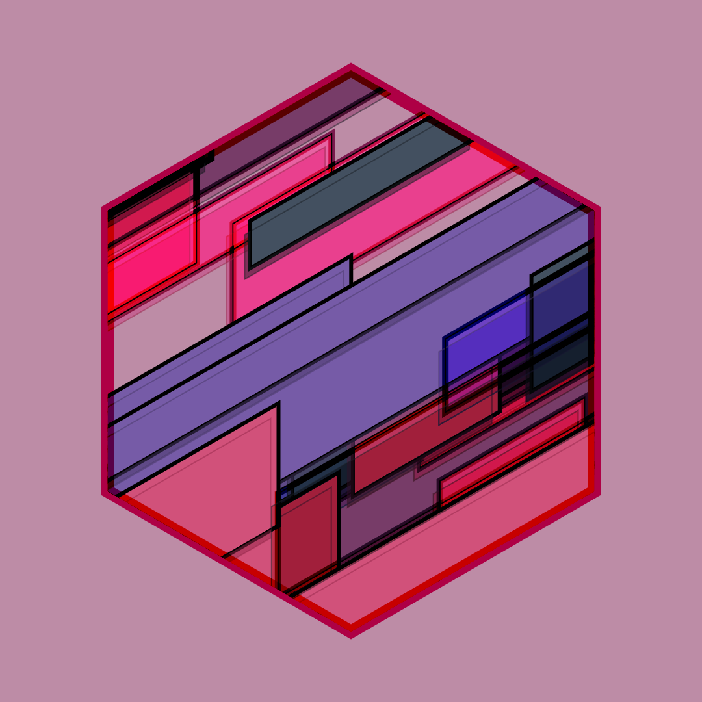
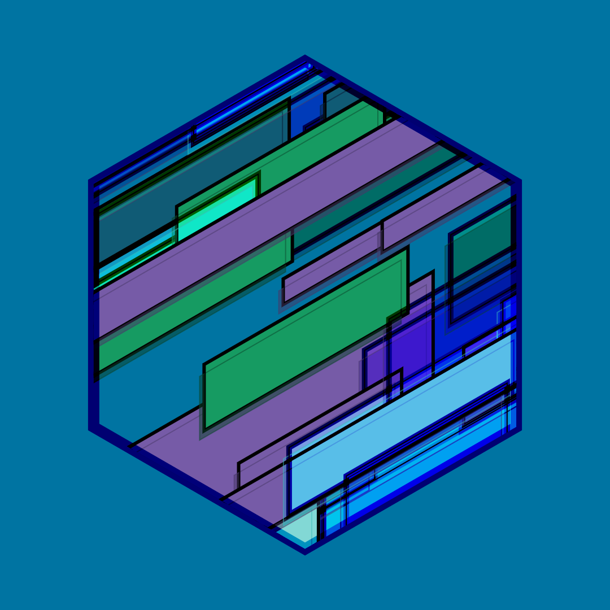

## Table of contents
* [General info](#general-info)
* [Technologies](#technologies)
* [Setup](#setup)

## General info
This project is inspired by the work of  Bruno Imbrizi.
Project by task:
* geometric elements arranged randomly
* random colors of geometric elements
* seed generation
* saving an image with ctr + s you can save the seed of the image

	
## Technologies
Project is created with:
*  canvasSketch
* canvas-sketch-util
* riso-colors
* Javascript
	
## Examples
# here are some examples

